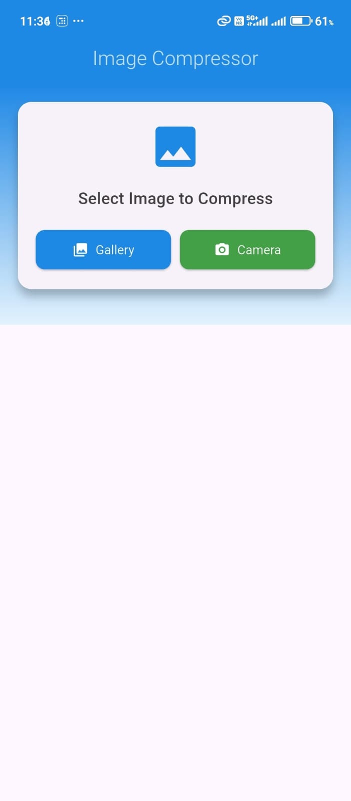
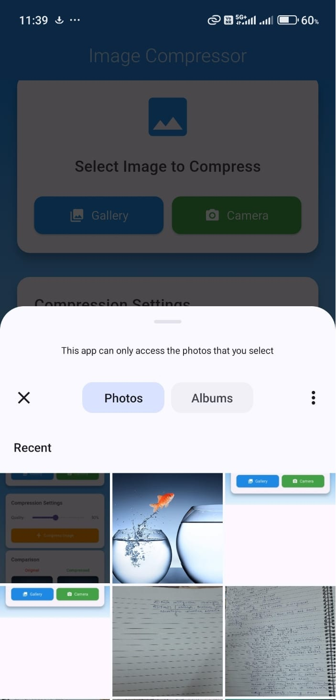
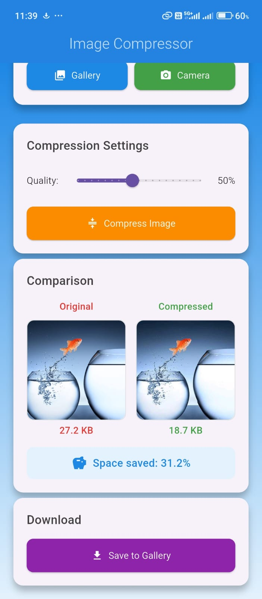
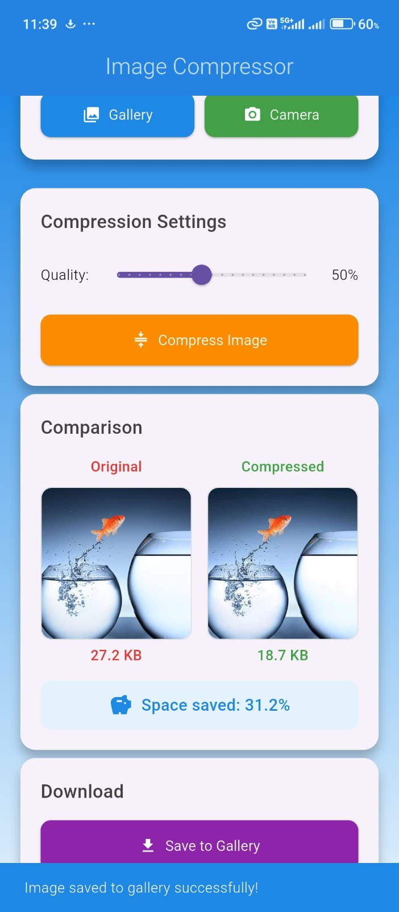

# 📱 Image Compressor App

A powerful and user-friendly Flutter application for compressing images with advanced features. Reduce image file sizes while maintaining quality, perfect for optimizing photos for social media, web uploads, or storage management.

---

## ✨ Features

- 📸 **Multiple Image Sources**: Pick images from gallery or capture with camera  
- 🎚️ **Adjustable Compression**: Quality slider from 10% to 100%  
- 📊 **Real-time Comparison**: Side-by-side view of original vs compressed images  
- 💾 **Smart Storage**: Save compressed images directly to device gallery  
- 📏 **Size Analytics**: Display original and compressed file sizes with savings percentage  
- 🎨 **Modern UI**: Beautiful gradient design with intuitive user experience  
- 🔒 **Permission Management**: Seamless handling of camera and storage permissions  
- 📱 **Cross-platform**: Works on both Android and iOS  

---

## 📱 Screenshots
 
&nbsp;&nbsp;&nbsp;

&nbsp;&nbsp;&nbsp;

&nbsp;&nbsp;&nbsp;



## 🚀 Getting Started

## Prerequisites

Make sure you have the following installed on your system:

- Flutter SDK (3.0.0 or higher)  
- Android Studio or VS Code  
- Git  


## Installation

#### Clone the repository 

```bash
git clone https://github.com/aadityaa-g18/ImageCompressor.git
```

#### Install Flutter dependencies

```bash
flutter pub get
```
#### Run the application

```bash
flutter run
```

## 🛠️ Dependencies

This project uses the following Flutter packages:

```image_picker: ^1.0.4``` – Image selection from gallery/camera

```flutter_image_compress: ^2.0.4``` – Image compression functionality

```path_provider: ^2.1.1``` – File system path management

```permission_handler: ^11.0.1``` – Runtime permissions handling

```gal: ^2.3.0``` – Gallery saving functionality

## 📋 Permissions

The app requires the following permissions (automatically handled):

```CAMERA``` – For capturing photos

```READ_EXTERNAL_STORAGE``` – For accessing gallery images

```READ_MEDIA_IMAGES``` – For Android 13+ media access

```WRITE_EXTERNAL_STORAGE``` – For saving compressed images (Android 12 and below)

In `android/app/src/main/AndroidManifest.xml`, add the following inside the `<manifest>` tag:

```xml
<uses-permission android:name="android.permission.CAMERA" />
<uses-permission android:name="android.permission.READ_EXTERNAL_STORAGE" />
<uses-permission android:name="android.permission.WRITE_EXTERNAL_STORAGE" />
<uses-permission android:name="android.permission.READ_MEDIA_IMAGES" />
```

### In `android/app/build.gradle:`

```
android {
    compileSdkVersion 33

    defaultConfig {
        ...
        minSdkVersion 21
        targetSdkVersion 33
    }

    compileOptions {
        sourceCompatibility JavaVersion.VERSION_11
        targetCompatibility JavaVersion.VERSION_11
    }

    kotlinOptions {
        jvmTarget = '11'
    }
}
```


⭐ If this project helped you, please give it a star! ⭐
